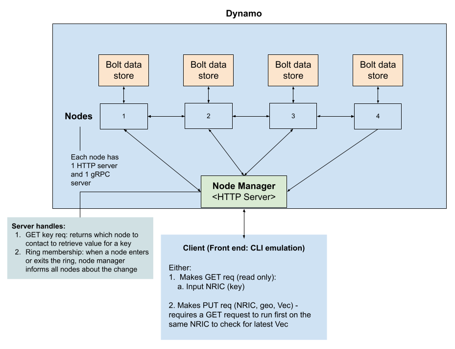

# 50.041 Dynamo Project
Group 6: Caryl Beatrice Aragon Peneyra (1004618), Ang Sok Teng, Cassie (1004542), Chua Mingkai (1004671), Tan Pei Wen (1004626)

This projects implements a simplified version of Dynamo, a distributed key-value store database that provides consistency through data versioning (vector clocks), partitions its data using consistent hashing and virtual nodes, and availability through data replication.

## Architecture


### Dynamo Node
Each node in Dynamo uses Bolt data store to store the key-value pairs. Each node runs a HTTP server and a gRPC server. The HTTP server handles requests from client to read and write key-value pairs, while the gRPC server is responsible for calls in between nodes, such as read and write requests for data replication.

HTTP endpoints:
* /addnode (POST) - Add new node to the ring. Request body:
```
{
    "NodeName": NODE_NAME
}
```
* /delnode (POST) - Remove node from the ring. Request body:
```
{
    "NodeName": NODE_NAME
}
```
* /confirmdel (POST) - Confirm node's request to exit (and trigger reallocation of keys) 
* /data (POST) - Write data to a bucket. Request body:
```
{
	"BucketName": BUCKET_NAME,
	"Object": {
        "Key": KEY,
        "Value": VALUE
    }
}
```
* /data (GET) - Get data at a given key in a bucket. Request body:
```
{
	"BucketName": BUCKET_NAME,
	"Key": KEY
}
```
* /db (GET) - View all existing bucket names. 
* /db/{bucketName} (POST) - Create new bucket if it does not exist. 
* /db/{bucketName} (GET) - View all key-value pairs in bucket. 
* /db/{bucketName}/{key} (POST) - Delete existing key in Bucket. 

### Node Manager
The node manager sits in front of the Dynamo nodes and runs a HTTP server. It informs clients of the node that it should contact for a certain key. The node manager also handles ring membership. Whenever a node wants to enter or exit the ring, it informs the node manager and the node manager will broadcast this information to the nodes and inform the nodes involved to do redistribution of keys. 

The node manager is assigned a fixed port number of 8000.

HTTP endpoints:
* /addNode (POST) - Add new node to its own ring and notifies other nodes of new member by posting to node’s HTTP server /addnode path. Request body:
```
{
    "NodeName": NODE_NAME
}
```
* /delNode (POST) - Remove node from its own ring, confirms removal to node's HTTP server /confirmdel path and notifies other nodes by posting to node's HTTP server /delnode path. Request body:
```
{
    "NodeName": NODE_NAME
}
```
* /getKey (GET) - Return client node responsible for key. Request body:
```
{
    "Key": KEY
}
```


### Client (Front-End)
The client first contacts the node manager to find out which node stores the key it is interested in. The client then contacts this node directly with its read request. If it receives multiple versions of the object, the client is responsible for merging the vector clock before writing the new value.

## How to Setup
### To run a node
`go run cmd/node/main.go -port PORTNUM [-file FILEPATH]`

Sets up the node running the HTTP server at `PORTNUM`. This includes setting up the HTTP and gRPC server and bbolt database. 
If the node suffered an intermittent fault (or to speed up testing), use the optional `FILEPATH` flag to specify the Ring backup file that it should read from.

### To run the Node Manager
`go run cmd/nodemanager/main.go`

Sets up the node manager at HTTP server `8000`. Does not maintain its own bbolt database nor gRPC server, instead managing the ring as a linked list of all nodes (including virtual). Add and delete node requests will update the linked list accordingly.
